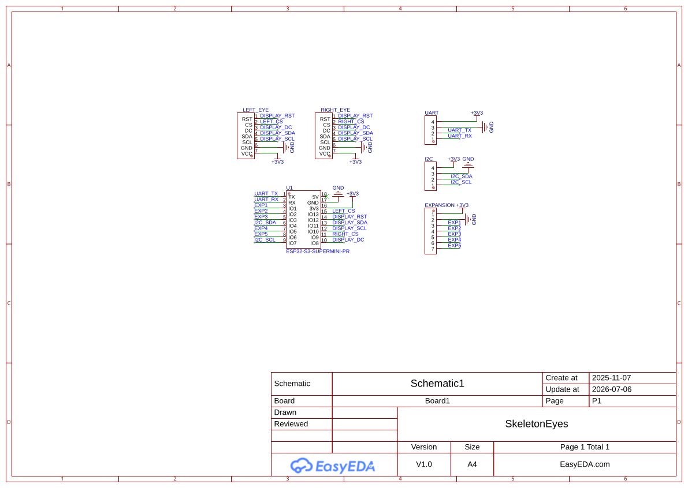

# Skeleton Eye

[](https://www.tindie.com/products/43596/)

Dual 1.28" TFT animatronic eyes with an I2C-controlled management board.

## Repository Layout

```
skeleton-eye2/
├── firmware/               # ESP32-S3 eye display controller
│   └── src/                # Procedural + sprite rendering, I2C slave, WiFi/OTA
├── lib/eye_control/        # C client library for controlling the eyes over I2C
├── management-board/       # ESP32-C3 I2C master controller
│   ├── src/eye_controller.ino  # Serial → I2C bridge
│   └── eye.sh                  # Send commands via USB serial
├── pcb/                    # Gerber files + drill files for the custom PCB
├── cad/                    # Frame/cover CAD files (DXF + STEP)
└── wiring.svg              # Wiring diagram
```

## Hardware

| Component | Board | Role |
|-----------|-------|------|
| Eye display controller | ESP32-S3 (LOLIN S3 Mini) | Drives 2× GC9A01 displays, I2C slave at `0x42` |
| Management board *(optional)* | ESP32-C3 (LOLIN C3 Mini) | I2C master, serial command interface — mainly for testing |

**Note:** The left eye display is physically mounted upside down. The firmware handles the 180-degree rotation automatically.

### Wiring



See [`firmware/README.md`](firmware/README.md) for display pin connections and [`management-board/README.md`](management-board/README.md) for I2C wiring details.

## Bill of Materials

| Part | Qty | Link |
|------|:---:|------|
| ESP32 S3 Supermini | 1 | [AliExpress](https://www.aliexpress.us/item/3256807337873344.html?spm=a2g0o.detail.pcDetailTopMoreOtherSeller.2.3fefkw0Rkw0RU6&gps-id=pcDetailTopMoreOtherSeller&scm=1007.40050.354490.0&scm_id=1007.40050.354490.0&scm-url=1007.40050.354490.0&pvid=ade58351-4cb6-4e9f-aca5-5e355a799bd2&_t=gps-id%3ApcDetailTopMoreOtherSeller%2Cscm-url%3A1007.40050.354490.0%2Cpvid%3Aade58351-4cb6-4e9f-aca5-5e355a799bd2%2Ctpp_buckets%3A668%232846%238111%231996&pdp_ext_f=%7B%22order%22%3A%221506%22%2C%22eval%22%3A%221%22%2C%22sceneId%22%3A%2230050%22%2C%22fromPage%22%3A%22recommend%22%7D&pdp_npi=6%40dis%21USD%213.70%213.70%21%21%213.70%213.70%21%402103129017833680899474687e10af%2112000053470840440%21rec%21US%21779428044%21XZ%211%210%21n_tag%3A-29919%3Bd%3Aef79cd72%3Bm03_new_user%3A-29895&utparam-url=scene%3ApcDetailTopMoreOtherSeller%7Cquery_from%3A%7Cx_object_id%3A1005007524188096%7C_p_origin_prod%3A) |
| 24.8mm Round Lens | 2 | [AliExpress](https://www.aliexpress.us/item/3256803507484638.html?spm=a2g0o.order_list.order_list_main.10.6fd21802wgVQCG&gatewayAdapt=glo2usa) |
| 1.28" Round TFT display module | 2 | [AliExpress](https://a.aliexpress.com/_m0m5OIX) |
| 4-pin JST Cable (10cm) | 1 | [AliExpress](https://www.aliexpress.us/item/3256812395686145.html?spm=a2g0o.productlist.main.12.452eyWH2yWH290&aem_p4p_detail=202607061309484785728354420000003254627&algo_pvid=c53960ed-9201-46c2-875d-28811d33ab6b&algo_exp_id=c53960ed-9201-46c2-875d-28811d33ab6b-11&pdp_ext_f=%7B%22order%22%3A%22-1%22%2C%22eval%22%3A%221%22%2C%22fromPage%22%3A%22search%22%7D&pdp_npi=6%40dis%21USD%213.98%213.86%21%21%2126.90%2126.09%21%402103122117833685883804237ecbe3%2112000058772626799%21sea%21US%21779428044%21X%211%210%21n_tag%3A-29919%3Bd%3Aef79cd72%3Bm03_new_user%3A-29895&curPageLogUid=bqqHWpeFGaVe&utparam-url=scene%3Asearch%7Cquery_from%3A%7Cx_object_id%3A1005012582000897%7C_p_origin_prod%3A&search_p4p_id=202607061309484785728354420000003254627_3) |
| Custom PCB | 1 | [Gerbers](pcb/) |
| 7-pin Male header | 1 | [AliExpress](https://www.aliexpress.us/item/2255800801798474.html?spm=a2g0o.productlist.main.9.391a689eIw3g5t&algo_pvid=fd377bbf-f8d2-41ab-8489-da17a4b5e2dc&algo_exp_id=fd377bbf-f8d2-41ab-8489-da17a4b5e2dc-8&pdp_ext_f=%7B%22order%22%3A%227925%22%2C%22eval%22%3A%221%22%2C%22fromPage%22%3A%22search%22%7D&pdp_npi=6%40dis%21USD%212.41%212.41%21%21%212.41%212.41%21%402103212517833702001582985e3961%2110000013202368872%21sea%21US%21779428044%21X%211%210%21n_tag%3A-29919%3Bd%3Aef79cd72%3Bm03_new_user%3A-29895&curPageLogUid=gZntkfC1A3Vy&utparam-url=scene%3Asearch%7Cquery_from%3A%7Cx_object_id%3A4000988113226%7C_p_origin_prod%3A) |
| 4-pin Female JST 2.54mm connector | 1 | [AliExpress](https://www.aliexpress.us/item/3256806894018733.html?spm=a2g0o.productlist.main.5.5b5dCrs1Crs1S9&algo_pvid=2bb296fb-8000-46ec-b6f9-a695695c9650&algo_exp_id=2bb296fb-8000-46ec-b6f9-a695695c9650-4&pdp_ext_f=%7B%22order%22%3A%226325%22%2C%22eval%22%3A%221%22%2C%22fromPage%22%3A%22search%22%7D&pdp_npi=6%40dis%21USD%211.85%211.84%21%21%211.85%211.84%21%402103110517833702411768114e5794%2112000039333381505%21sea%21US%21779428044%21X%211%210%21n_tag%3A-29919%3Bd%3Aef79cd72%3Bm03_new_user%3A-29895&curPageLogUid=2QzdvSZ0EfeY&utparam-url=scene%3Asearch%7Cquery_from%3A%7Cx_object_id%3A1005007080333485%7C_p_origin_prod%3A) |
| 3D printed cover | 1 | [CAD](cad/) |
| M3 x 16mm cap head machine screw | 1 | — |
| M3 Nut | 1 | — |

## Quick Start

### Prerequisites

- PlatformIO CLI (`pip install platformio`)
- Python 3 with Pillow (`pip install Pillow`) for custom sprite conversion

### Build and Upload

```bash
# Build and upload firmware
cd firmware && make upload

# Optional: build and upload management board (for testing)
cd management-board && make upload
```

## Features

- **Dual rendering modes**: Procedural 3D eye rendering with lighting, eyelids, and reflections, or pre-rendered sprite animations
- **I2C external control**: Full remote control over I2C bus with smooth gaze, blink, squint, and color commands
- **WiFi OTA updates**: Over-the-air firmware updates with progress display on the eyes
- **C client library**: Drop-in C library for integrating eye control into your own firmware projects
- **Serial interface**: Interactive command shell via USB serial or the included `eye.sh` script

See the subdirectory READMEs for serial commands, I2C protocol details, and sprite development.
